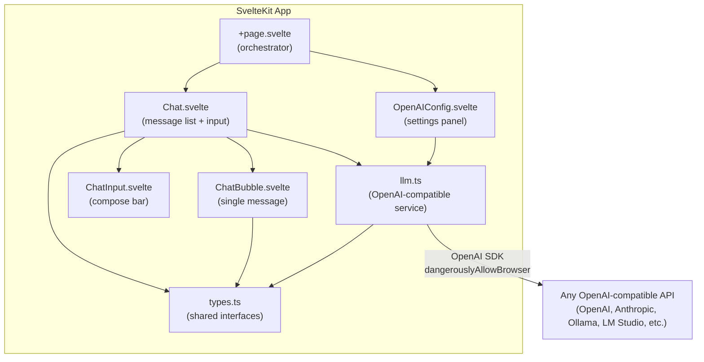

# Implementation Plan: sv5-chat-demo — BYOT LLM Chat Interface

> **Goal**: Take the existing skeleton from [gzuuus/sv5-chat-demo](https://github.com/gzuuus/sv5-chat-demo), fork it, and make the LLM API work with a functional chat. This will serve as the reference implementation for the LLM chat interface on [contextvm.org](https://contextvm.org).

> **Guiding principle** (from maintainer): *"Don't focus on advanced features. Just make the LLM API work with a functional chat. Once that is done we could add conversation management to store conversations in IndexDB for example and get it to a point where it is fully functional for the basic features."*

---

## 1. Codebase Audit — Current State

The fork ([1amKhush/sv5-chat-demo](https://github.com/1amKhush/sv5-chat-demo)) is 2 commits ahead of the upstream skeleton:

| Layer | Files | Status |
|-------|-------|--------|
| **Framework** | SvelteKit 2 + Svelte 5, Tailwind CSS 4, shadcn-svelte | ✅ Solid foundation |
| **UI Primitives** | `avatar`, `button`, `card`, `input`, `scroll-area` | ✅ Present via shadcn |
| **Service** | [openai.ts](file:///home/khush/code_hub/sv5-chat-demo/src/lib/services/openai.ts) | ⚠️ Has bugs, non-functional |
| **Components** | [Chat.svelte](file:///home/khush/code_hub/sv5-chat-demo/src/lib/components/Chat.svelte), [ChatBubble.svelte](file:///home/khush/code_hub/sv5-chat-demo/src/lib/components/ChatBubble.svelte), [ChatInput.svelte](file:///home/khush/code_hub/sv5-chat-demo/src/lib/components/ChatInput.svelte), [OpenAIConfig.svelte](file:///home/khush/code_hub/sv5-chat-demo/src/lib/components/OpenAIConfig.svelte) | ⚠️ Skeleton only, several issues |
| **Page** | [+page.svelte](file:///home/khush/code_hub/sv5-chat-demo/src/routes/+page.svelte) | ⚠️ Wires things together but has gaps |

### Identified Bugs & Gaps

| # | Severity | File | Issue |
|---|----------|------|-------|
| 1 | 🔴 Critical | `openai.ts` | **Model hardcoded to `gpt-5`** — a model that doesn't exist on most providers. For BYOT, users must be able to pick their own model. |
| 2 | 🔴 Critical | `OpenAIConfig.svelte` | **Test connection mutates the global singleton** — `handleTestConnection()` calls `getOpenAIService({ baseURL: tempBaseURL, apiKey: tempAPIKey })` which permanently overwrites the live service with temporary/unsaved credentials. |
| 3 | 🟡 Major | `openai.ts` | **BaseURL normalization is fragile** — The trailing-slash and `chat/completions` stripping logic has ordering bugs (checks `endsWith('chat/completions')` after already appending `/`, so the check never matches). Many OpenAI-compatible APIs (Ollama, LM Studio, etc.) use `/v1` as the base path, and users will paste URLs in many formats. |
| 4 | 🟡 Major | `ChatBubble.svelte` | **No markdown rendering** — LLM responses are almost always markdown-formatted (code blocks, lists, bold, etc.) but the bubble just renders `{message.text}` as plain text. |
| 5 | 🟡 Major | `Chat.svelte` | **No abort/cancel mechanism** — Once a streaming request starts, there's no way to cancel it. Users must wait for the full response or refresh the page. |
| 6 | 🟡 Major | `Chat.svelte` | **Error banner is light-mode only** — `bg-red-50 text-red-800` is invisible in dark mode. |
| 7 | 🟢 Minor | `Chat.svelte`, `+page.svelte` | **`Message` interface duplicated** — Defined in both files; should be in a shared types file. |
| 8 | 🟢 Minor | `Chat.svelte` | **Fragile message IDs** — `messages.length + 1` can produce duplicates if messages are deleted or if streaming creates temporary entries. |
| 9 | 🟢 Minor | `openai.ts` | **`max_tokens: 1000` hardcoded** — Very short for many use cases; should either be configurable or use a sensible default (4096). |
| 10 | 🟢 Minor | `+page.svelte` | **Unused `Message` import** — The `Message` interface is defined locally in `+page.svelte` but never used there. |
| 11 | 🟢 Minor | `Chat.svelte` | **Welcome message is static** — "Hello! Welcome to our chat interface" doesn't reflect the configured provider/model. |
| 12 | 🟢 Minor | `OpenAIConfig.svelte` | **No visual feedback on save** — User clicks "Save" but gets no confirmation that credentials were persisted. |

---

## 2. Architecture — Target State (Phase 1)

The target for Phase 1 is a **functional, clean BYOT chat** — nothing more. The architecture stays simple and flat:



> [!IMPORTANT]
> The service layer talks directly to the LLM API from the browser. This is the intentional BYOT design — users bring their own API key. There is no backend proxy.

---

## 3. Phase 1 — Working Demo

### 3.1 Shared Types

**File**: `src/lib/types.ts` (new)

Extract and consolidate the duplicated `Message` interface and add the config type:

```typescript
export interface Message {
  id: string;           // UUID instead of fragile numeric ID
  content: string;      // renamed from 'text' for OpenAI SDK alignment
  role: 'user' | 'assistant' | 'system';  // use OpenAI role names directly
  timestamp: Date;
}

export interface LLMConfig {
  baseURL: string;
  apiKey: string;
  model: string;        // user-configurable model name
}
```

> [!TIP]
> Using `role` and `content` (matching the OpenAI Chat Completions schema) instead of `sender` and `text` eliminates the need for a mapping layer between UI and API messages. The `ChatMessage` type in `openai.ts` becomes unnecessary.

---

### 3.2 Service Layer Rewrite

**File**: `src/lib/services/llm.ts` (rename from `openai.ts`)

The current service has several bugs and the architecture needs a minor reshape. Here's the plan:

#### 3.2.1 — Fix BaseURL normalization

Replace the fragile string manipulation with a robust `URL`-based normalizer:

```typescript
function normalizeBaseURL(raw: string): string {
  let url = raw.trim();
  // Strip trailing path fragments users might paste by mistake
  for (const suffix of ['/chat/completions', '/v1/chat/completions']) {
    if (url.endsWith(suffix)) {
      url = url.slice(0, -suffix.length);
    }
  }
  // Ensure no trailing slash (the SDK appends its own paths)
  return url.replace(/\/+$/, '');
}
```

#### 3.2.2 — Make model configurable

Remove the hardcoded `'gpt-5'` model string. Accept `model` as a parameter in `sendMessage()` and store it in the config:

```typescript
async sendMessage(
  messages: Message[],
  model: string,
  onChunk?: (chunk: string) => void,
  signal?: AbortSignal       // for cancellation
): Promise<string>
```

#### 3.2.3 — Add AbortController support

The OpenAI SDK supports `signal` for cancellation. Thread it through:

```typescript
const stream = await this.client.chat.completions.create(
  { model, messages: apiMessages, stream: true },
  { signal }   // pass AbortSignal to SDK
);
```

#### 3.2.4 — Fix the singleton mutation bug

The `testConnection` flow should **not** mutate the global service. Instead, create a temporary throwaway client:

```typescript
async testConnection(config: LLMConfig): Promise<{ ok: boolean; error?: string }> {
  // Create a temporary client — do NOT touch the singleton
  const testClient = new OpenAI({
    apiKey: config.apiKey,
    baseURL: normalizeBaseURL(config.baseURL),
    dangerouslyAllowBrowser: true,
  });

  try {
    await testClient.models.list();
    return { ok: true };
  } catch (err) {
    return { ok: false, error: err instanceof Error ? err.message : String(err) };
  }
}
```

#### 3.2.5 — Improve error handling

Use the OpenAI SDK's typed error classes instead of string matching:

```typescript
import OpenAI, { APIError } from 'openai';

// In catch block:
if (err instanceof APIError) {
  switch (err.status) {
    case 401: throw new Error('Invalid API key.');
    case 404: throw new Error('Model not found or invalid endpoint.');
    case 429: throw new Error('Rate limit exceeded. Try again later.');
    default:  throw new Error(`API error (${err.status}): ${err.message}`);
  }
}
```

#### 3.2.6 — Remove `testDirectConnection()`

The raw `fetch`-based `testDirectConnection()` method duplicates what the SDK already does and adds confusion. Remove it entirely.

#### 3.2.7 — Increase `max_tokens` default

Change from `1000` to `4096` (or omit entirely to let the API decide):

```diff
- max_tokens: 1000,
+ max_tokens: 4096,
```

---

### 3.3 Config Component

**File**: `src/lib/components/OpenAIConfig.svelte`

#### 3.3.1 — Add model field

Add a text input for the model name (default: `gpt-4o`). This is the core of BYOT — different providers expose different models.

#### 3.3.2 — Fix test connection to not mutate singleton

Call the new `testConnection(config)` that creates a throwaway client instead of `getOpenAIService(tempConfig)`.

#### 3.3.3 — Persist model to localStorage

Alongside `openai-base-url` and `openai-api-key`, save and restore `openai-model`.

#### 3.3.4 — Add save confirmation feedback

After save, briefly show a ✓ checkmark or toast to confirm credentials were persisted.

#### 3.3.5 — Dark mode fix for test results

Replace `bg-gray-50` with theme-aware classes (`bg-muted text-muted-foreground`).

---

### 3.4 Chat Component

**File**: `src/lib/components/Chat.svelte`

#### 3.4.1 — Use shared `Message` type

Import from `$lib/types` instead of defining locally.

#### 3.4.2 — Use UUID for message IDs

```typescript
import { crypto } from globalThis;
// ...
id: crypto.randomUUID(),
```

#### 3.4.3 — Add cancellation support

- Create an `AbortController` when starting a request
- Pass `controller.signal` to `sendMessage()`
- Add a "Stop" button that appears during generation (replaces the send button)
- On abort, keep the partially streamed text as the assistant message

```typescript
let abortController: AbortController | null = $state(null);

async function handleSendMessage(text: string) {
  abortController = new AbortController();
  // ... pass abortController.signal to service
}

function handleCancel() {
  abortController?.abort();
}
```

#### 3.4.4 — Fix error banner for dark mode

```diff
- <div class="mb-4 rounded-md bg-red-50 p-3 text-sm text-red-800">
+ <div class="mb-4 rounded-md bg-destructive/10 p-3 text-sm text-destructive">
```

#### 3.4.5 — Remove hardcoded welcome message

Start with an empty message list. Instead, show a centered empty state:

```svelte
{#if messages.length === 0}
  <div class="flex h-full items-center justify-center text-muted-foreground">
    <p>Send a message to start chatting.</p>
  </div>
{/if}
```

#### 3.4.6 — Pass model from config to service calls

Thread the `model` string from the page-level config state down into the `sendMessage()` call.

---

### 3.5 ChatBubble Component

**File**: `src/lib/components/ChatBubble.svelte`

#### 3.5.1 — Add basic markdown rendering

Install a lightweight markdown renderer. Two options (in order of preference):

1. **`marked` + `DOMPurify`** — Parse markdown to HTML, sanitize, render with `{@html}`. Lightweight and widely used.
2. **`svelte-markdown`** — Svelte-native markdown component. Slightly heavier but no `{@html}`.

Go with option 1 for the demo:

```bash
npm install marked dompurify
npm install -D @types/dompurify
```

```svelte
<script lang="ts">
  import { marked } from 'marked';
  import DOMPurify from 'dompurify';

  // ... existing props ...

  const renderedHTML = $derived(
    message.role === 'assistant'
      ? DOMPurify.sanitize(marked.parse(message.content))
      : ''
  );
</script>

<!-- For assistant messages -->
{#if message.role === 'assistant'}
  <div class="prose prose-sm dark:prose-invert max-w-none">
    {@html renderedHTML}
  </div>
{:else}
  {message.content}
{/if}
```

> [!NOTE]
> Install `@tailwindcss/typography` for the `prose` classes to style markdown output properly. Add to `app.css`:
> ```css
> @plugin '@tailwindcss/typography';
> ```

#### 3.5.2 — Use shared `Message` type

Import from `$lib/types`.

---

### 3.6 ChatInput Component

**File**: `src/lib/components/ChatInput.svelte`

#### 3.6.1 — Add stop button

When `isLoading` is true, swap the Send icon for a Stop/Square icon that calls `onCancel`:

```svelte
<script lang="ts">
  import { Send, Square } from 'lucide-svelte';

  let {
    onSend,
    onCancel,
    isLoading = false
  }: {
    onSend: (message: string) => void;
    onCancel?: () => void;
    isLoading?: boolean;
  } = $props();
</script>

{#if isLoading}
  <Button type="button" size="icon" variant="destructive" onclick={onCancel}>
    <Square class="h-4 w-4" />
  </Button>
{:else}
  <Button type="submit" size="icon" disabled={!inputValue.trim()}>
    <Send class="h-4 w-4" />
  </Button>
{/if}
```

#### 3.6.2 — Auto-resize textarea

Replace the single-line `<Input>` with a `<textarea>` that grows vertically as the user types (up to a max height). This is standard for chat interfaces:

```svelte
<textarea
  bind:value={inputValue}
  placeholder="Type your message..."
  rows="1"
  class="flex-1 resize-none overflow-hidden"
  style="max-height: 150px"
  oninput={(e) => {
    e.target.style.height = 'auto';
    e.target.style.height = e.target.scrollHeight + 'px';
  }}
/>
```

---

### 3.7 Page Orchestrator

**File**: `src/routes/+page.svelte`

#### 3.7.1 — Add model to config state

```typescript
let model = $state('gpt-4o');
```

#### 3.7.2 — Clean up unused `Message` interface

Remove the locally defined `Message` interface (it's now in `$lib/types`).

#### 3.7.3 — Thread model through to Chat

Pass model as a prop to `<Chat>` so it can forward it to the service.

---

## 4. Implementation Order — Step-by-Step Checklist

> [!IMPORTANT]
> Each step should be a **single, testable commit**. The chat should remain functional (or at least buildable) after every step.

### Step 1: Foundation — Types & Service Fix
- [ ] Create `src/lib/types.ts` with `Message` and `LLMConfig` interfaces
- [ ] Rewrite `src/lib/services/openai.ts` → `src/lib/services/llm.ts`
  - Fix baseURL normalization
  - Make model configurable
  - Add AbortSignal support
  - Fix singleton mutation in test
  - Use typed SDK errors
  - Remove `testDirectConnection()`
  - Bump `max_tokens` to 4096
- [ ] Update all imports from `openai.ts` → `llm.ts`
- [ ] **Test**: Build passes, no runtime errors on load

### Step 2: Config — Model Field & Fixes
- [ ] Add model text input to `OpenAIConfig.svelte`
- [ ] Fix test connection to use throwaway client
- [ ] Persist/restore model from localStorage
- [ ] Fix dark mode styling on test result display
- [ ] Add save confirmation feedback
- [ ] **Test**: Can configure baseURL + apiKey + model, save persists, test connection works without corrupting live service

### Step 3: Chat — Core Flow & Cancellation
- [ ] Update `Chat.svelte` to use shared `Message` type with UUID IDs
- [ ] Wire up `model` from config to `sendMessage()` calls
- [ ] Add `AbortController` for cancellation
- [ ] Fix error banner dark mode
- [ ] Replace welcome message with empty state
- [ ] Update `ChatInput.svelte` with stop button and auto-resize textarea
- [ ] **Test**: Can send messages, get streaming responses, cancel mid-stream, errors display correctly in both light and dark mode

### Step 4: Markdown Rendering
- [ ] Install `marked`, `dompurify`, `@tailwindcss/typography`
- [ ] Update `ChatBubble.svelte` to render assistant messages as sanitized markdown
- [ ] Add `prose` typography styles
- [ ] **Test**: Code blocks, lists, bold/italic render correctly in assistant responses

### Step 5: Polish & Cleanup
- [ ] Remove all `console.log` debug statements from service and components
- [ ] Clean up unused imports and dead code
- [ ] Ensure the app works end-to-end with at least one provider (e.g., OpenAI, or a free tier like Groq)
- [ ] Update README with usage instructions (how to configure, what providers are supported)
- [ ] **Test**: Full end-to-end flow — configure → send message → get streaming response → cancel → new message → markdown renders

---

## 5. Phase 2 — Future Enhancements (Out of Scope for Demo)

These are explicitly **deferred** per maintainer guidance, but documented for planning:

| Feature | Description | Complexity |
|---------|-------------|------------|
| **Conversation management** | Sidebar with conversation list, create/switch/delete conversations | Medium |
| **IndexedDB persistence** | Store conversations in IndexedDB so they survive page reloads | Medium |
| **System prompt config** | Let users customize the system prompt | Low |
| **Model discovery** | Auto-fetch available models from the `/models` endpoint | Low |
| **Export/Import** | Export conversations as JSON/Markdown | Low |
| **Token counting** | Show approximate token usage per message | Medium |
| **Dark/Light toggle** | Theme toggle in the UI (currently follows system preference) | Low |
| **Mobile responsiveness** | Full mobile layout optimization | Medium |

---

## 6. Files Changed Summary

| Action | File | What Changes |
|--------|------|--------------|
| **Create** | `src/lib/types.ts` | Shared `Message` and `LLMConfig` interfaces |
| **Rewrite** | `src/lib/services/openai.ts` → `src/lib/services/llm.ts` | Full service rewrite — model config, abort, error handling, URL normalization |
| **Modify** | `src/lib/components/OpenAIConfig.svelte` | Add model field, fix test mutation, dark mode, save feedback |
| **Modify** | `src/lib/components/Chat.svelte` | Shared types, UUID IDs, cancellation, empty state, error styling |
| **Modify** | `src/lib/components/ChatBubble.svelte` | Markdown rendering, shared types |
| **Modify** | `src/lib/components/ChatInput.svelte` | Stop button, auto-resize textarea |
| **Modify** | `src/routes/+page.svelte` | Add model state, clean up unused code, thread config |
| **Modify** | `src/app.css` | Add typography plugin |
| **Modify** | `package.json` | Add `marked`, `dompurify`, `@tailwindcss/typography` |
| **Delete** | — | `testDirectConnection()` method from service |

> [!NOTE]
> The total scope is deliberately small — ~7 files modified, 1 created, 0 deleted. This is a surgical fix of the existing skeleton, not a rewrite.

---

## 7. Commit Table

This table outlines a systematic, scoped approach to committing the changes. Each commit represents a logical, self-contained unit of work that ensures the application remains functional throughout the development process.

| Order | Commit Message | Files Changed | Description of Changes |
|---|---|---|---|
| 1 | `refactor: extract shared types for chat messages and llm config` | `src/lib/types.ts`<br>`src/routes/+page.svelte` | Creates a central location for `Message` and `LLMConfig` interfaces. Removes local `Message` type from `+page.svelte`. |
| 2 | `fix: robustify openai service layer for byot functionality` | `src/lib/services/openai.ts` (renamed to `llm.ts`)<br>`src/routes/+page.svelte` | Overhauls the service: fixes URL normalization, removes hardcoded `gpt-5`, introduces `AbortSignal` for cancellation, fixes test client mutation, implements typed SDK errors, and removes the redundant `testDirectConnection` method. Updates imports. |
| 3 | `feat: add model configuration and persistent storage` | `src/lib/components/OpenAIConfig.svelte`<br>`src/routes/+page.svelte` | Adds a model input field to the config UI. Implements `localStorage` persistence for the model string. Wires the configured model down through `+page.svelte` to the chat service. Fixes dark mode styling in test results. |
| 4 | `feat: implement stream cancellation and improve chat flow` | `src/lib/components/Chat.svelte`<br>`src/lib/components/ChatInput.svelte` | Adds an `AbortController` to handle message cancellation. Introduces a 'Stop' button in the input area during streaming. Swaps numeric message IDs for robust UUIDs. Replaces static welcome message with a clean empty state. |
| 5 | `feat: enable markdown rendering for assistant responses` | `package.json`<br>`bun.lock`<br>`src/app.css`<br>`src/lib/components/ChatBubble.svelte` | Installs `marked`, `dompurify`, and `@tailwindcss/typography`. Updates `ChatBubble` to safely parse and render assistant messages as HTML. Adds Tailwind typography plugin to `app.css`. |
| 6 | `chore: polish ui elements and remove debug artifacts` | `src/lib/components/Chat.svelte`<br>`src/lib/components/ChatInput.svelte`<br>`src/lib/services/llm.ts` | Adjusts error banner colors for dark mode visibility. Converts single-line input to an auto-resizing `textarea`. Removes lingering `console.log` statements from development. |
| 7 | `docs: update readme with setup and provider usage instructions` | `README.md` | Updates project documentation to explain BYOT configuration, list supported OpenAI-compatible providers, and provide clear local development steps. |
